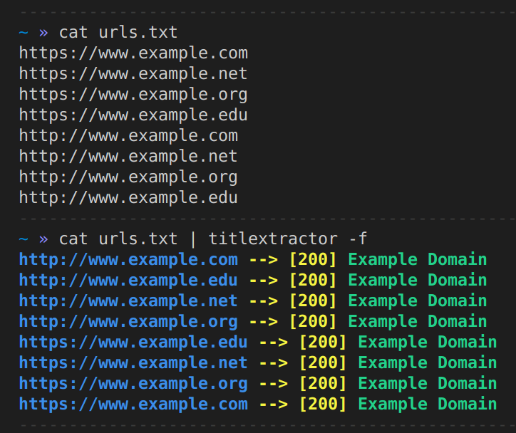

# TitleXtractor   

This tool takes a list of urls and extracts the content of `<title>` tag.

---
## Dependencies
`titlextractor` needs [golang.org/x/net/html](https://godoc.org/golang.org/x/net/html) package in order to parse HTML.
```
go get -u golang.org/x/net/html
```

---
## Install 
```
go get -u github.com/dellalibera/titlextractor/
```
---

## Usage
Parameter   | Description
----------- | -------------
-t          | Specify the request timeout (expressed in seconds - default 20s)
-f          | Boolean value used to decide to follow or not redirections (default false)
-n          | Number of concurrent workers (default 20) 
-c          | Boolean value used to color the output (default false)
---

## Examples
```
cat urls.txt | titlextractor -f -c
```


---

## Resources
I was inspired by:
- [Tokenizing HTML Streams in Go](https://drstearns.github.io/tutorials/tokenizing/)
- [httprobe](https://github.com/tomnomnom/httprobe)

---
## License
[MIT](https://github.com/dellalibera/titlefinder/blob/master/LICENSE) 
